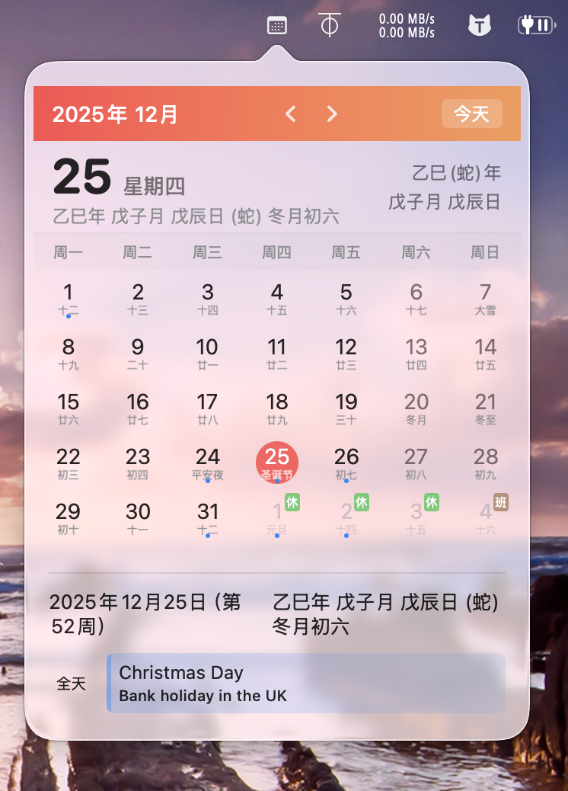
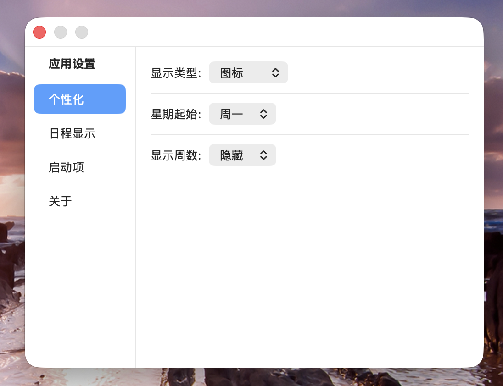

# 岁时 (LunarBar)

**岁时 (LunarBar)** 是一款轻巧、纯净的 macOS 菜单栏日历应用。它专为理解中国传统节气与历法而设计，完全离线运行，守护您的隐私与专注。

## ✨ 核心亮点

*   **纯净体验**: 界面精致，资源占用极低。完全离线，无需网络权限。
*   **传统历法**: 
    *   精准的**公历**与**农历**对照。
    *   **二十四节气**精确展示。
    *   **黄历宜忌**：基于《协纪辨方书》与丛辰派算法，提供每日**宜**与**忌**建议。
    *   **十二建除**：显示每日建除十二神（如建、除、满、平等）。
    *   **天干地支**：包含年、月、日三柱干支的精准算法（基于五虎遁/五鼠遁原理）。
*   **法定节假日**: 内置 2015-2026 年中国法定节假日及调休安排（数据来源权威）。
*   **系统融合**: 无缝集成 macOS 系统日历 (EventKit)，直接在菜单栏查看和管理您的日常安排。
*   **高度定制**:
    *   菜单栏显示项可配置（图标/时间/日期/农历）。
    *   支持开机自启。

## 🛠️ 技术栈

*   **语言**: Swift 5.9+
*   **UI 框架**: SwiftUI
*   **架构**: MVVM
*   **数据**: 本地 JSON 数据源 (不依赖远程 API)

## 📸 预览

## 📅 节假日数据来源

法定节假日数据感谢以下开源项目：
*   [NateScarlet/holiday-cn](https://github.com/NateScarlet/holiday-cn)

## 参考

初始代码参考来自项目 https://github.com/bylinxx/MacCalendar 

## 📄 许可证

具体的 License 请查看仓库中的 LICENSE 文件。
